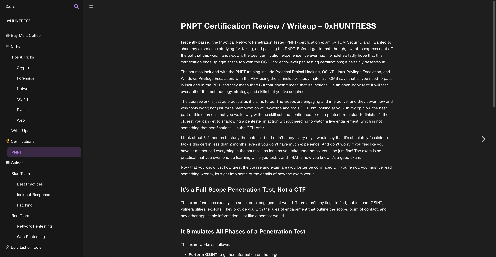

# wp-gitbook dark mode

A port of the [Gitbook default theme](https://github.com/GitbookIO/theme-default) for WordPress

## Setup

You will need to assign a nav menu to the sidebar to use this theme. The next and previous arrows will follow the next and previous menu item, so set the order of your content using the standard nav menus.

This theme utilizes the Ajax Search Lite plugin. In order for the search to function properly, the Ajax Search Lite plugin must be installed.
